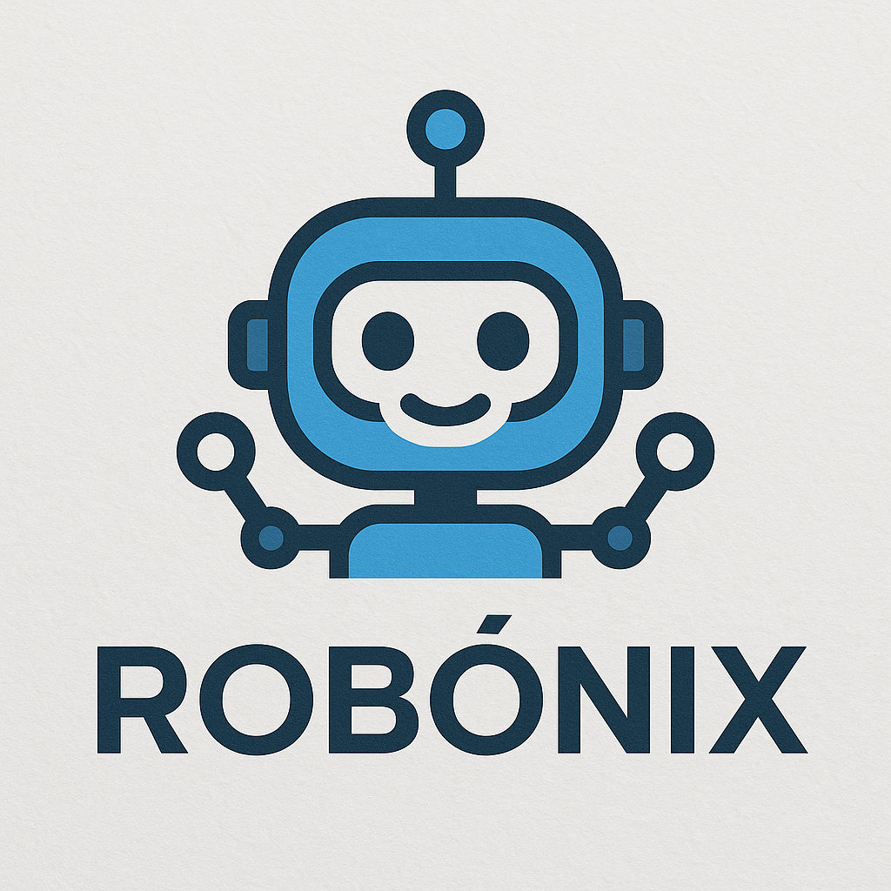

# robonix
<div align="center">
  
</div>

**robonix** is an open-source embodied intelligence framework.

## Setup

```bash
git clone --recurse-submodules https://github.com/syswonder/robonix.git
```

1. install ROS2 humble: https://docs.ros.org/en/humble/Installation.html
2. build your driver and capability ROS2 node (enter the folder and run build.sh or colcon build)

## Startup

```bash
cd robonix
python3 ./manager/boot.py --config {YOUR_BOOT_CONFIG}
```

Please see examples configs in `config/include`.

## Action Programming and Simulation

for user action programming and simulation, you need to install the following packages:

```bash
pip install rich loguru mcp pyyaml argparse # basic packages for uapi and manager
pip install grpcio grpcio-tools genesis-world pynput # if you want to use genesis simulator
pip install openai  python-dotenv # for LLM-generated action
```

run `python3 ./simulator/genesis/robot1.py` to start the genesis simulator, then run example python scripts in `./simulator/examples` to run the abstract action program.