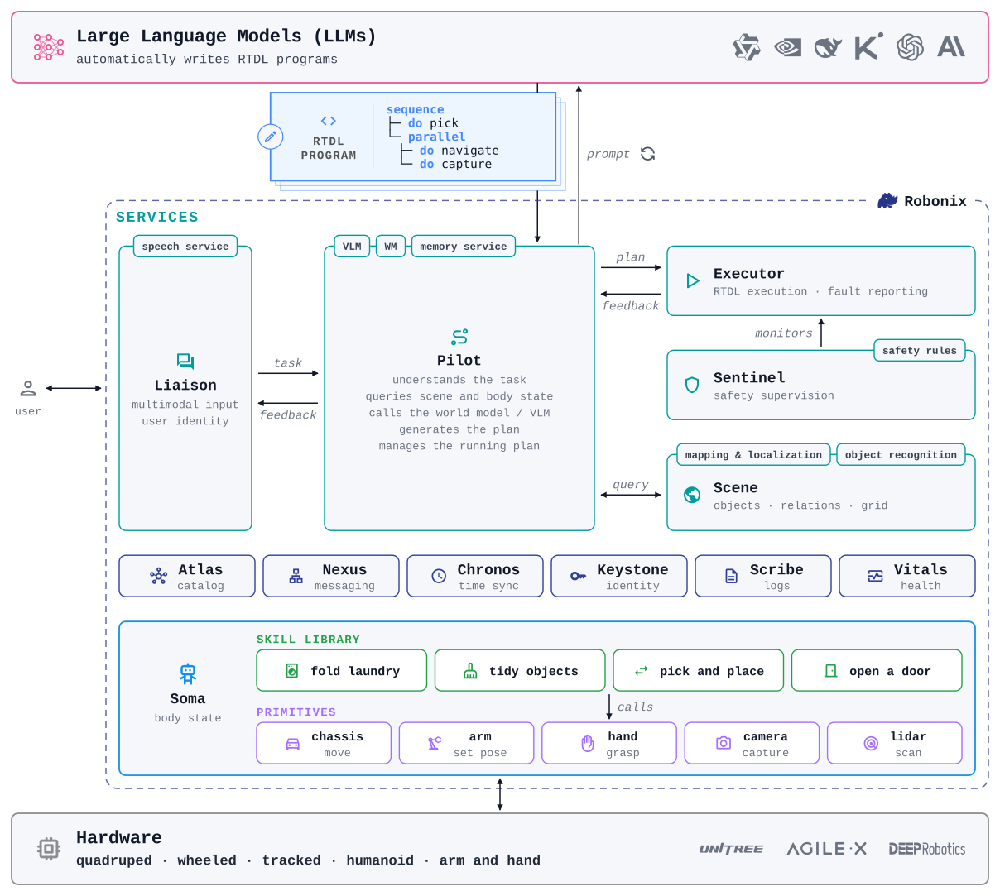

<p align="center">
  
</p>

<h3 align="center">Robonix — An Agentic Operating System for Embodied AI</h3>

<p align="center">
  <em>A system substrate for building embodied intelligence across heterogeneous robots.</em>
</p>

<p align="center">
  <a href="https://robonix.ai"><b>robonix.ai</b></a>
  &nbsp;·&nbsp;
  <a href="https://book.robonix.ai/">Documentation</a>
  &nbsp;·&nbsp;
  <a href="https://packages.robonix.ai/">Package catalog</a>
  &nbsp;·&nbsp;
  <a href="#quick-start">Quick start</a>
</p>

<p align="center">
  <a href="https://github.com/syswonder/robonix/blob/main/LICENSE"></a>
  
  
  
  <a href="https://packages.robonix.ai/packages/"></a>
  <a href="#supported-robots"></a>
  <a href="https://deepwiki.com/syswonder/robonix"></a>
</p>
<br />

**Robonix** is a general-purpose agentic operating system designed for embodied artificial intelligence. It employs large language models (LLMs) and vision-language models (VLMs) to convert natural-language tasks into Robot Task Description Language (RTDL) programs, which are then executed to complete the specified tasks. The primary advantages of Robonix include the following:

- **(1) Hardware–software decoupling.** Robonix utilizes layered capability abstractions *(Task, Skill, Service, Primitive)*  to separate software functionality from robot-specific hardware. These abstractions establish standard interface definition language (IDL) interfaces, enabling the reuse of compatible primitives, services, and skills across different robotic platforms.
- **(2) Adaptability to diverse user tasks, robot capabilities, and environments.** Robonix leverages LLMs and VLMs to generate *RTDL programs* tailored to each user's task, the robot's capabilities, registered skills, environmental conditions, and body state. This approach enables Robonix to accommodate a wide range of natural language tasks, robotic hardware, and operational environments.
- **(3) Observable and verifiable execution.** Robonix explicitly represents the model's program in RTDL, allowing for inspection of its structure. The system performs program validation prior to execution and can verify specified outcomes upon completion.

## Design of Robonix

<p align="center">
  
</p>


The figure illustrates the overall architecture of Robonix. The user interacts with **Liaison**, which delegates the **task** to **Pilot.** Pilot formulates a plan using the model and forwards it to **Executor**. **Sentinel** monitors Executor, while **Scene** maintains the semantic objects and relations of the outer world. The skill library provides reusable behaviors. Beneath the skill library, six system components are present. And **Soma** manages the robot's body description and state, the **primitives** expose hardware functions and interface with the robot's hardware.

| Abstraction   | Definition                                                   |
| ------------- | ------------------------------------------------------------ |
| **primitive** | A single hardware function — sensing or actuation — behind a software interface. |
| **service**   | Reusable software that implements a Robonix interface, such as planning, execution, interaction and scene management. |
| **skill**     | A learned model or an algorithmic procedure, packaged as a reusable executable unit. |
| **task**      | A goal, its constraints, and the conditions that count as completion. |

Each primitive, service, and skill specifies its offerings in a versioned contract and registers with [Atlas](http://system/atlas/) at startup. Callers bind to the contract rather than the underlying implementation, enabling task transfer to another body and allowing implementations to be replaced without modifying callers.

The subsequent [System Architecture](http://#system-architecture) section introduces additional components.

## Quick Start

### Prerequisites

Install these from their own documentation first — Robonix does not provide or install them for you.

| Tool | Why it is needed | Install |
| --- | --- | --- |
| **Rust** (stable) | The system components are Rust; `make install` builds them with cargo | [rustup.rs](https://rustup.rs/) |
| **uv** | Resolves and runs the Python workspace — services and primitives | [docs.astral.sh/uv](https://docs.astral.sh/uv/getting-started/installation/) |
| **Docker** | Runs the Webots simulator stack, and any capability provider you choose to containerize | [docs.docker.com](https://docs.docker.com/engine/install/) |

Rust and uv install into your home directory, so put them on `PATH` before continuing:

```bash
export PATH="$HOME/.local/bin:$HOME/.cargo/bin:$PATH"
```

### Install Robonix

```bash
git clone --recursive https://github.com/syswonder/robonix.git
cd robonix
make install
```

This builds the system components and the `rbnx` command-line interface (CLI) into `~/.cargo/bin`. See [Host Platforms](#host-platforms) for what is regularly tested.

Start the Webots simulator in one terminal:

```bash
export DISPLAY=:0
bash examples/webots/sim/start.sh
```

Boot Robonix in a second terminal with any OpenAI-compatible VLM endpoint:

```bash
export RMW_IMPLEMENTATION=rmw_zenoh_cpp
export VLM_BASE_URL=https://api.openai.com/v1
export VLM_API_KEY=sk-...
export VLM_MODEL=your-model-name

cd examples/webots
rbnx build
rbnx boot
```

Then run `rbnx chat` in a third terminal. Try `go to room 101`, `what can you see?`, or `explore the office`. See the [Getting Started guide](https://book.robonix.ai/getting-started/quickstart) for the complete walkthrough.

## Quick Development

The [Robonix package template](https://github.com/syswonder/template-rbnx) contains a mock primitive, a service, and a skill that boot without robot hardware:

```bash
git clone https://github.com/syswonder/template-rbnx.git
cd template-rbnx
cp .env.example .env
# Fill in the three VLM values in .env.
set -a; source .env; set +a
rbnx build
rbnx boot
```

Run `rbnx caps` to inspect the live providers, then try `rbnx chat` and ask the robot to say hello. Each example package keeps its manifest, `config.spec`, build/start scripts, implementation, and optional capability definitions in one directory. Start there, then follow the [package integration guide](https://book.robonix.ai/integration-guide/package-catalog) to publish a reusable package.

## Supported Robots

[](https://packages.robonix.ai/robots/)

Robot bodies published to the catalog, with more on the way: wheeled, tracked, and quadruped bases, fixed and dual arms, standalone dexterous hands, a humanoid, and four simulated bodies. They span several vendors' chassis software development kits (SDKs), both versions of the Robot Operating System (ROS 1 and ROS 2), and both grippers and five-finger hands, while running the same system services, capability contracts, and skills.

<table>
  <tr>
    <td align="center" width="16.6%"><a href="https://packages.robonix.ai/robots/robonix.robot.agilex.ranger_mini_v3/"><br /><sub><b>AgileX Ranger Mini v3</b></sub></a></td>
    <td align="center" width="16.6%"><a href="https://packages.robonix.ai/robots/robonix.robot.deep_robotics.lite3/"><br /><sub><b>DEEP Robotics Lite3</b></sub></a></td>
    <td align="center" width="16.6%"><a href="https://packages.robonix.ai/robots/robonix.robot.deep_robotics.lynx_s10/"><br /><sub><b>DEEP Robotics Lynx S10</b></sub></a></td>
    <td align="center" width="16.6%"><a href="https://packages.robonix.ai/robots/robonix.robot.unitree.go2/"><br /><sub><b>Unitree Go2</b></sub></a></td>
    <td align="center" width="16.6%"><a href="https://packages.robonix.ai/robots/robonix.robot.yobotics.y20w/"><br /><sub><b>Yobotics Y20W</b></sub></a></td>
    <td align="center" width="16.6%"><a href="https://packages.robonix.ai/robots/robonix.robot.mirrorme.bpx/"><br /><sub><b>MirrorMe BPX</b></sub></a></td>
  </tr>
  <tr>
    <td align="center"><a href="https://packages.robonix.ai/robots/robonix.robot.wheeltec.r550/"><br /><sub><b>WHEELTEC R550</b></sub></a></td>
    <td align="center"><a href="https://packages.robonix.ai/robots/robonix.robot.yahboom.rosmaster_x3/"><br /><sub><b>Yahboom ROSMASTER X3</b></sub></a></td>
    <td align="center"><a href="https://packages.robonix.ai/robots/robonix.robot.hantewin.benben/"><br /><sub><b>Hantewin Benben</b></sub></a></td>
    <td align="center"><a href="https://packages.robonix.ai/robots/robonix.robot.beingbeyond.d1/"><br /><sub><b>BeingBeyond D1</b></sub></a></td>
    <td align="center"><a href="https://packages.robonix.ai/robots/robonix.robot.agilex.dual_piper/"><br /><sub><b>AgileX Dual Piper</b></sub></a></td>
    <td align="center"><a href="https://packages.robonix.ai/robots/robonix.robot.wowrobo.roboarm/"><br /><sub><b>WowRobo Roboarm</b></sub></a></td>
  </tr>
  <tr>
    <td align="center"><a href="https://packages.robonix.ai/robots/robonix.robot.linkerbot.linker_hand_o6/"><br /><sub><b>LinkerHand O6</b></sub></a></td>
    <td align="center"><a href="https://packages.robonix.ai/robots/robonix.robot.pal_robotics.tiago_webots/"><br /><sub><b>Webots TIAGo Lite (sim)</b></sub></a></td>
    <td align="center"><a href="https://packages.robonix.ai/robots/robonix.robot.syswonder.minecraft_bot/"><br /><sub><b>Minecraft Bot (sim)</b></sub></a></td>
    <td align="center"><a href="https://packages.robonix.ai/robots/robonix.robot.agilex.ranger_with_piper_mujoco/"><br /><sub><b>Ranger + Piper (sim)</b></sub></a></td>
    <td align="center"><a href="https://packages.robonix.ai/robots/robonix.robot.unitree.go2_mujoco/"><br /><sub><b>Unitree Go2 (sim)</b></sub></a></td>
  </tr>
</table>

<details>
<summary><b>Per-robot hardware and links</b></summary>

| Robot | Hardware | Maintainer | Links |
| --- | --- | --- | --- |
| AgileX Ranger Mini v3 | Ranger Mini v3 chassis; Livox MID-360 lidar and IMU; RealSense D435i RGB-D; optional Piper arm; audio | syswonder | [repo](https://github.com/syswonder/robot-agilex-ranger_mini_v3) · [catalog](https://packages.robonix.ai/robots/robonix.robot.agilex.ranger_mini_v3/) |
| DEEP Robotics Lite3 | Lite3 quadruped; Livox MID-360 lidar and IMU; Orbbec Gemini 330 RGB-D | [Bunnycxk](https://github.com/Bunnycxk) | [repo](https://github.com/syswonder/robot-deep_robotics-lite3) · [catalog](https://packages.robonix.ai/robots/robonix.robot.deep_robotics.lite3/) |
| DEEP Robotics Lynx S10 | Lynx S10 wheeled-quadruped over UDP; Orbbec Gemini 336L RGB-D; InternVLA navigation | [1mujue](https://github.com/1mujue) | [repo](https://github.com/syswonder/robot-deep_robotics-lynx_s10) · [catalog](https://packages.robonix.ai/robots/robonix.robot.deep_robotics.lynx_s10/) |
| Unitree Go2 | Go2 quadruped; onboard lidar, camera, IMU; audio bridge | [Origamii520](https://github.com/Origamii520) | [repo](https://github.com/syswonder/robot-unitree-go2) · [catalog](https://packages.robonix.ai/robots/robonix.robot.unitree.go2/) |
| Yobotics Y20W | Y20W chassis and posture; Livox MID-360 lidar; RealSense D435i RGB-D; speech | [chenx1118](https://github.com/chenx1118) | [repo](https://github.com/syswonder/robot-yobotics-y20w) · [catalog](https://packages.robonix.ai/robots/robonix.robot.yobotics.y20w/) |
| MirrorMe BPX | BPX quadruped; odometry; guarded stand and sit posture control | [nonkr](https://github.com/nonkr) | [repo](https://github.com/mirrormerobotics/robot-mirrorme-bpx) · [catalog](https://packages.robonix.ai/robots/robonix.robot.mirrorme.bpx/) |
| WHEELTEC R550 | R550 tracked chassis and IMU; LSLIDAR N10P; Orbbec Astra S RGB-D | [sherry-part](https://github.com/sherry-part) | [repo](https://github.com/syswonder/robot-wheeltec-r550) · [catalog](https://packages.robonix.ai/robots/robonix.robot.wheeltec.r550/) |
| Yahboom ROSMASTER X3 | Mecanum chassis on Jetson TX2 NX; RPLidar; guarded ROS 1 navigation | [luoyg0831-a11y](https://github.com/luoyg0831-a11y) | [repo](https://github.com/syswonder/robot-yahboom-rosmaster_x3) · [catalog](https://packages.robonix.ai/robots/robonix.robot.yahboom.rosmaster_x3/) |
| Hantewin Benben | Benben chassis; Livox MID-360 and LSLIDAR LakiBeam1; RealSense camera; audio | [Futaba19-c](https://github.com/Futaba19-c) | [repo](https://github.com/syswonder/robot-hantewin-benben) · [catalog](https://packages.robonix.ai/robots/robonix.robot.hantewin.benben/) |
| BeingBeyond D1 | Fixed-base 6-DOF arm; 2-DOF head; five-finger hand; head RGB-D; pick, place, stack, sort | [Ciliphen](https://github.com/Ciliphen) | [repo](https://github.com/syswonder/robot-beingbeyond-d1) · [catalog](https://packages.robonix.ai/robots/robonix.robot.beingbeyond.d1/) |
| AgileX Dual Piper | Two Piper arms and CAN grippers on separate buses; per-arm joint telemetry | syswonder | [repo](https://github.com/syswonder/robot-agilex-dual_piper) · [catalog](https://packages.robonix.ai/robots/robonix.robot.agilex.dual_piper/) |
| WowRobo Roboarm | Five-axis LeRobot Koch arm; Orbbec Gemini 215 RGB-D; audio | [gaoyz1235](https://github.com/gaoyz1235) | [repo](https://github.com/syswonder/robot-wowrobo-roboarm) · [catalog](https://packages.robonix.ai/robots/robonix.robot.wowrobo.roboarm/) |
| LinkerHand O6 | Standalone six-axis five-finger hand over CAN; gesture and finger-motion skills | [Ciliphen](https://github.com/Ciliphen) | [repo](https://github.com/syswonder/robot-linkerbot-linker_hand_o6) · [catalog](https://packages.robonix.ai/robots/robonix.robot.linkerbot.linker_hand_o6/) |
| Webots TIAGo Lite (sim) | Simulated differential-drive base; head RGB-D; Hokuyo lidar; audio | syswonder | [repo](https://github.com/syswonder/robot-pal_robotics-tiago_webots) · [catalog](https://packages.robonix.ai/robots/robonix.robot.pal_robotics.tiago_webots/) |
| Minecraft Bot (sim) | Minecraft player body; camera, chassis, world state, inventory, navigation | [ZZJJWarth](https://github.com/ZZJJWarth) | [repo](https://github.com/syswonder/robot-syswonder-minecraft_bot) · [catalog](https://packages.robonix.ai/robots/robonix.robot.syswonder.minecraft_bot/) |
| Ranger + Piper (sim) | MuJoCo Ranger Mini v3 and Piper; web or native viewer; mapping, navigation, manipulation | syswonder | [repo](https://github.com/syswonder/robot-agilex-ranger_with_piper_mujoco) · [catalog](https://packages.robonix.ai/robots/robonix.robot.agilex.ranger_with_piper_mujoco/) |
| Unitree Go2 (sim) | MuJoCo Go2 quadruped; web or native viewer; exploration and semantic navigation | syswonder | [repo](https://github.com/syswonder/robot-unitree-go2-mujoco) · [catalog](https://packages.robonix.ai/robots/robonix.robot.unitree.go2_mujoco/) |

</details>

Each deployment links the complete robot manifest and its primitive, service, and skill dependencies. Published deployment metadata does not replace the hardware-specific safety, commissioning, and acceptance gates documented by each repository. See the [robot catalog](https://packages.robonix.ai/robots/) for published integrations.

## Packages

Every robot above is assembled from packages, not written as one program. A package declares the capabilities it provides against the shared contracts, so what it offers does not depend on which body it was written for, and a deployment can swap one implementation for another without the layers above noticing.

[](https://packages.robonix.ai/packages/)

Browse them in the [package catalog](https://packages.robonix.ai/packages/), or publish your own with the [package integration guide](https://book.robonix.ai/integration-guide/package-catalog).

## Host Platforms

The Rust system components and the Python packages are written to stay portable across architectures; x86-64, arm64 (NVIDIA Jetson), and LoongArch64 are tested.

| Arch    | OS / Distribution                                  | Status     |
| ------- | -------------------------------------------------- | ---------- |
| x86\_64 | Ubuntu 22.04                                       | ✅ Tested  |
| x86\_64 | Debian 13                                          | ✅ Tested  |
| arm64   | NVIDIA Jetson — JetPack 6.2 (L4T 36.4.3, Ubuntu 22.04) | ✅ Tested  |
| LoongArch64 | Loongson 3A6000 + AMD Radeon 7900 XTX — Loong ArchLinux 2026.08.07 | ✅ Tested |
| x86\_64 / arm64 | Ubuntu 24.04 and newer                     | 🚧 Planned |

> **Note (LoongArch64):** Robonix itself runs on the Loongson 3A6000 host, while the simulation platform (Webots) runs on a separate x86\_64 machine with Ubuntu 22.04. The two machines are connected over Ethernet on the same local area network (LAN).

"Tested" means the full Robonix pipeline runs end-to-end on that platform — in simulation or on a real robot: voice & interaction, task execution, body movement, scene & mapping (semantic map + spatial map), navigation, and skill execution. Other Linux distributions will likely work but are not regularly verified.

Capability providers that use ROS 2 are built and tested against [ROS 2 Humble](https://docs.ros.org/en/humble/).

## System Architecture

The **system** layer provides Robonix's shared runtime infrastructure. Its six built-in components handle capability registration, communication, identity and configuration, time, logging, and health monitoring:

| System component | Responsibility |
| --- | --- |
| **[atlas](system/atlas/)** | Capability catalog — every running provider and its contract |
| **[nexus](system/nexus/)** | Communication over gRPC, the Model Context Protocol (MCP), and ROS 2 |
| **[keystone](system/keystone/)** | Identity, configuration, and access policy |
| **[chronos](system/chronos/)** | One time source across sensors, actuators, and components |
| **[scribe](system/scribe/)** | Structured logging |
| **[vitals](system/vitals/)** | Onboard health: temperatures, voltage, joint motors |

Services are reusable software components that implement Robonix interfaces. Robonix provides the planning, execution, interaction, scene, and embodiment services below, alongside other services such as navigation and mapping. The skill library is a separate architectural layer. Soma launches deployed skills, Pilot discovers them through Atlas, and Executor invokes them.

| Service | Responsibility |
| --- | --- |
| **[pilot](system/pilot/)** | Turns a task into an RTDL program with the model, and validates it |
| **[executor](system/executor/)** | Runs the program, dispatching each call to its provider |
| **[soma](system/soma/)** | The robot's body description and state |
| **[scene](system/scene/)** | The environment: objects, their relations, and an occupancy grid |
| **[sentinel](system/sentinel/)** | Decides whether a capability call is allowed |
| **[liaison](system/liaison/)** | User input — text and voice |

Every contract lives in [`capabilities/`](capabilities/), whether a system component, a service, or a package implements it. Primitives and skills live in their own repositories. Currently, all 12 components are under the `system` directory for historical reasons.

## Documentation

Full documentation lives at **[book.robonix.ai](https://book.robonix.ai/)**.

**Getting started**

* [Quickstart](https://book.robonix.ai/getting-started/quickstart) — the full version of the Webots walkthrough in this README
* [Host Platforms](#host-platforms) — what is tested, and what is not

**Understanding the system**

* [Architecture overview](https://book.robonix.ai/architecture/components) — the control plane, and one full request end to end
* [Namespaces & contracts](https://book.robonix.ai/architecture/namespace-and-contracts) — how `robonix/primitive/*`, `robonix/service/*`, `robonix/skill/*`, and `robonix/system/*` relate
* [Interface catalog](https://book.robonix.ai/interface-catalog/) — every primitive and service contract, generated from `capabilities/`

**Building on it**

* [Package integration guide](https://book.robonix.ai/integration-guide/package-catalog) — write a package and publish it to the catalog
* [Package catalog](https://packages.robonix.ai/packages/) — every published package, browsable by kind
* [Robot catalog](https://packages.robonix.ai/robots/) — every published deployment, with its full dependency tree

## Changelog

Release history lives in [CHANGELOG.md](CHANGELOG.md), formatted per [Keep a Changelog](https://keepachangelog.com/en/1.1.0/). Contributors add entries under `## [Unreleased]`; they are moved into a versioned section at release time.

## Contributing

See [CONTRIBUTING.md](CONTRIBUTING.md) for the repository's license headers, code style, validation commands, commit format, human-authorship policy, and AI assistance disclosure rules.

## License

Mulan Permissive Software License, Version 2 (MulanPSL-2.0). See [LICENSE](LICENSE).
