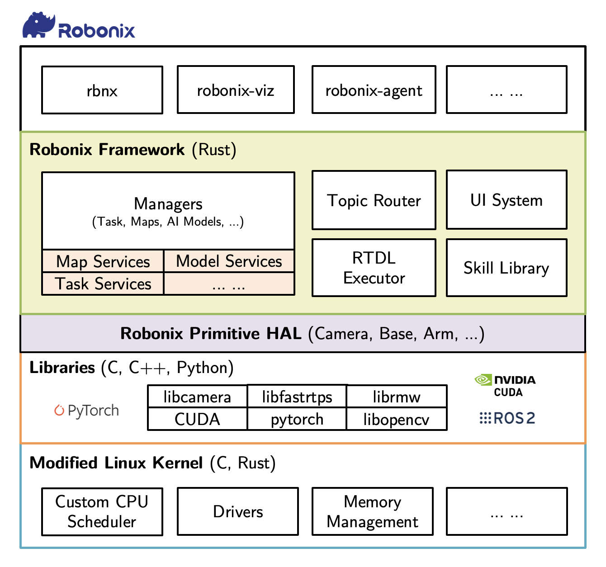

# Robonix

**Robonix** is an open-source embodied intelligence framework built with Rust and ROS2, implementing the EAIOS (Embodied AI Operating System) architecture.

> [!WARNING]
> **Important notice**  
> Robonix is in an early, fast-moving development phase. **All interfaces, IDL formats, and internal Rust module designs may change without notice.**  
> Until a stable release is published, **no API or implementation stability is guaranteed**. Do not rely on current interfaces for production or long-term compatibility.

## Architecture

  

Robonix follows the EAIOS architecture with four core components:

- **Task Manager**: Global scheduling and control core, responsible for task parsing, planning, and execution coordination
- **Skill Library**: Stores reusable skills that can be called at runtime
- **Service Registry**: Manages standardized algorithm capabilities (perception, planning, evaluation, verification)
- **Primitive Abstraction Layer**: Provides standardized hardware capability mapping, managing access to actuators and sensors

## Roadmap

- [ ] **RIDL (Robonix IDL) based on ROS IDL** — RIDL as the canonical interface description for HAL, services, and skills, including messages, services, events, and versioning rules.
- [ ] **RIDL codegen and HAL/service interfaces** — stabilize RIDL schemas for HAL and services and provide Rust, C++, and Python code generators integrated into the build.
- [ ] **Core HAL and service library** — ship baseline HALs for common sensors/actuators and core services for navigation, perception, and task orchestration.

## Quick Start

See [robonix quickstart](rust/README.md)

## License

See LICENSE file for details.
