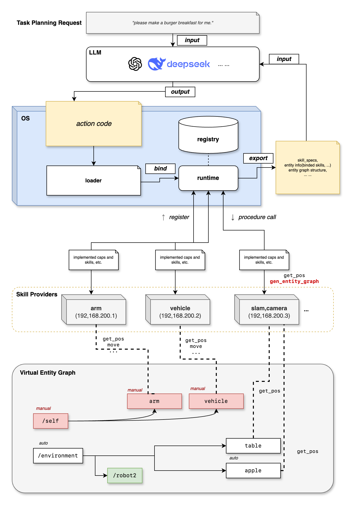

DeepEmbody OS 开发文档
=====================

.. admonition:: 项目信息
   :class: info

   代码仓库：https://github.com/HustWolfzzb/DeepEmbody

   Syswonder 社区：https://www.syswonder.org

DeepEmbody OS（DEOS）是由 Syswonder 开发的、面向具身智能（Embodied AI）场景进行通用编程的具身操作系统（Embodied OS），提供了包括编程模型虚拟实体图（Virtual Entity Graph，VEG），Capbility-Skill-Action-Task（CSAT）抽象层次、Action 程序语法与运行时，以及基于 Genesis 模拟器和 Piper Ranger 四轮小车的完整运行框架。

**Overview Structure of DeepEmbody OS**

**文档索引**

.. toctree::
   :maxdepth: 3
   :caption: 模块文档

   uapi/index
   manager/index
   genesis/index

.. toctree::
   :maxdepth: 2
   :caption: API 参考文档

   api/index

.. toctree::
   :maxdepth: 1
   :caption: 示例代码

   examples/simple_demo

.. raw:: html

   

索引和表格
==========

* :ref:`genindex`
* :ref:`modindex`
* :ref:`search`