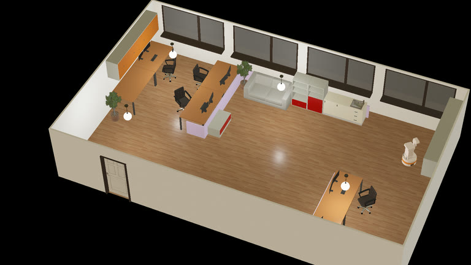
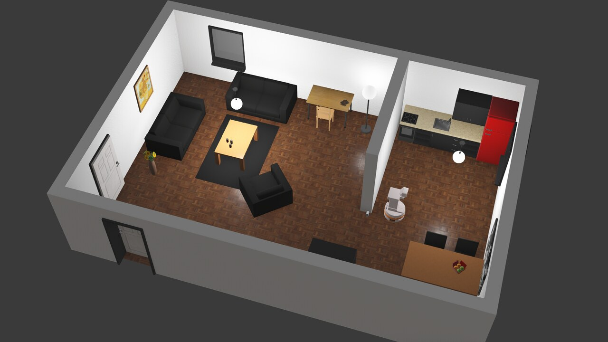
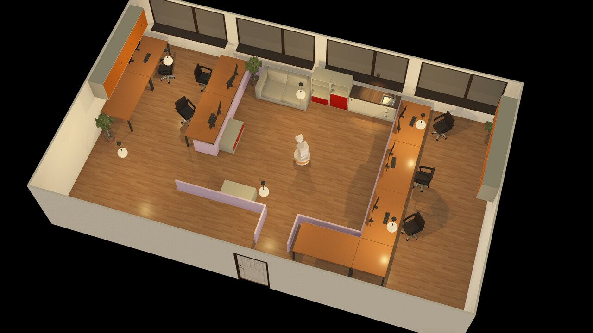
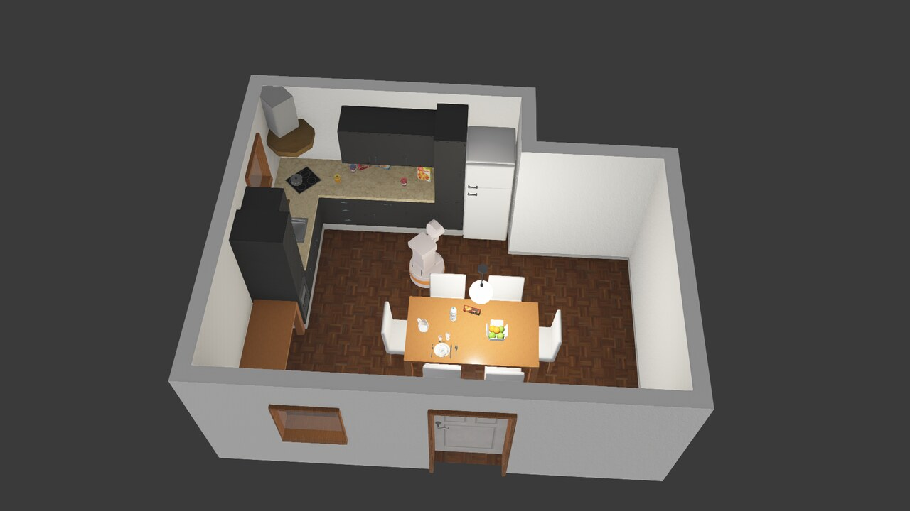

# Webots Tiago example

End-to-end demo: Webots Tiago sim + per-device robonix driver packages
+ Nav2 service + agent loop. Goal: bring it up and control the robot
from `rbnx chat`.

## Layout

```
examples/webots/
├── sim/                       NOT a robonix package. Plain docker
│   ├── start.sh               compose stack (Webots + eaios_webots).
│   └── ...                    Bring up FIRST, before anything else.
├── primitives/                One device = one package.
│   ├── tiago_chassis/         /amcl_pose + /cmd_vel  → chassis/{state, move}
│   ├── tiago_camera/          /head_front_camera/*   → camera/{snapshot, depth_snapshot}
│   └── tiago_lidar/           /scanner               → lidar/snapshot
├── services/
│   └── tiago_nav2/            Nav2 launch + ActionClient wrapper
└── robonix_manifest.yaml      Top-level deploy manifest.
```

The three simulator-specific drivers run **inside** the sim container via
`docker exec` so they share the simulator's DDS graph. Reusable audio
primitives are fetched from their SysWonder repositories by
`robonix_manifest.yaml` and run on the host.

## Bring-up

Two terminals only:

```bash
# T1 — simulator (Ctrl-C stops log following only):
bash examples/webots/sim/start.sh

# T2 — robonix stack (whatever robonix_manifest.yaml declares):
cd examples/webots
rbnx boot
```

The commands above use the default host network. If the simulator uses a
Docker bridge (for example, for parallel isolated runs), its Zenoh router is
published only on host loopback. In that mode, start the host-side Robonix
stack with `ROBONIX_ZENOH_ROUTER=tcp/127.0.0.1:<mapped-port>`; this setting is
required even when `<mapped-port>` is the default `7447`:

```bash
# T1 — isolated simulator
ROBONIX_SIM_NETWORK=bridge ROBONIX_SIM_ZENOH_PORT=17447 \
  bash examples/webots/sim/start.sh

# T2 — matching host-side deployment
cd examples/webots
export ROBONIX_ZENOH_ROUTER=tcp/127.0.0.1:17447
rbnx boot
```

The sim launcher supports multiple built-in worlds:

```bash
bash examples/webots/sim/start.sh --world office.wbt
bash examples/webots/sim/start.sh --world apartment.wbt
bash examples/webots/sim/start.sh --world complete_apartment.wbt
bash examples/webots/sim/start.sh --world break_room.wbt
bash examples/webots/sim/start.sh --world kitchen.wbt
```

You can also pre-export `ROBONIX_WEBOTS_WORLD=<world>.wbt`.

`office.wbt` is the default. Its small, checksum-pinned cache downloads once
from the
[`syswonder/robonix-assets`](https://github.com/syswonder/robonix-assets/releases/tag/webots-office-seed-v3)
Release through `https://ghfast.top/` and is then reused from the persistent
Docker volume. For `apartment.wbt`, `complete_apartment.wbt`, `break_room.wbt`,
and `kitchen.wbt`, enable the official Webots offline asset bundle once:

```bash
ROBONIX_WEBOTS_DOWNLOAD_ALL_ASSETS=1 \
  bash examples/webots/sim/start.sh --world apartment.wbt
```

This downloads Cyberbotics' `assets-R2025a.zip` release asset through the same
mirror and stores it in the persistent Webots cache volume. Later runs reuse
the cache.

|  |  |
|---|---|
| `office.wbt`<br> | `apartment.wbt`<br> |
| `complete_apartment.wbt`<br> | `break_room.wbt`<br> |
| `kitchen.wbt`<br> |  |

Then a third terminal for `rbnx chat`. `rbnx caps` lists the
capabilities atlas knows about; `rbnx tools` lists the MCP tools
the LLM agent can call.

The simulator and Robonix deployment have separate lifecycle owners. Stop both
explicitly from another shell:

```bash
cd examples/webots
rbnx shutdown     # stop only this Robonix deployment
bash sim/stop.sh  # stop only the selected Webots Compose project and its RViz wrapper
```

When the simulator was started with custom `ROBONIX_SIM_PROJECT` or
`ROBONIX_SIM_CONTAINER` values, pass the same values to `sim/stop.sh`. The
simulator stop command never searches for or terminates host-side Robonix
processes.

`rbnx shutdown` reads `rbnx-boot/state.json` (boot writes it
incrementally as components come up) and tears them down in
reverse order. Each chassis / camera / lidar / nav2 package's
`scripts/start.sh` installs a `trap` that pkills the in-container
python on EXIT/INT/TERM — so the docker-exec'd drivers don't
strand the next bring-up by holding ports 50111-50113 / 50211-50213.

## Env vars

Pre-export before `rbnx boot` (or set in shell rc):

```bash
export VLM_BASE_URL=https://api.openai.com/v1   # or your OpenAI-compatible endpoint
export VLM_API_KEY=sk-...
export VLM_MODEL=gpt-5.5
```

The deploy manifest references these via `${VLM_*}`.

## What `rbnx boot` does

1. Reads `robonix_manifest.yaml`, brings up the `system:` block (atlas,
   executor, pilot) using their installed binaries — args (listen
   address, log level, VLM endpoint) come straight out of the manifest.
2. For each `primitive:` / `service:` entry, in declaration order:
   - Spawns the package via `rbnx start -p <path>` (which runs that
     package's `scripts/start.sh` — for tiago drivers that's a
     `docker exec` into the sim container that runs the Python driver).
   - Polls atlas until the package registers its first capability.
   - Verifies that the provider declared exactly one lifecycle Driver. Omitted
     package declarations select `robonix/lifecycle/driver`; an old generated
     package may use only its exact namespace Driver. A provider with neither
     fails startup and must be rebuilt or migrated.
   - Calls `Driver(CMD_INIT, config_json)`, then `Driver(CMD_ACTIVATE)` for
     primitives and services. Missing lifecycle callbacks are warning-only
     no-ops inside the Driver, not permission to run without the Driver.
3. Sits on Ctrl-C / SIGTERM, then tears down all children.

## How the LLM picks tools

After `rbnx boot` is up, pilot's system prompt lists each provider's
`CAPABILITY.md` path; the LLM uses the executor's `read_file` builtin
to lazy-load the docs it needs (e.g. `read_file("/path/to/tiago_chassis/CAPABILITY.md")`).

Tools are exposed to the LLM as `<area>_<leaf>` to avoid leaf-name
collisions (camera and lidar both have a `snapshot` leaf — the LLM
sees `camera_snapshot` and `lidar_snapshot`). The MCP server inside
each driver still registers tools by leaf name.

The pilot's persistence prompt instructs the LLM to keep iterating
tools-then-reason until the task is *verifiably* done — taking a
fresh `camera/snapshot` after every physical action to confirm
progress.
