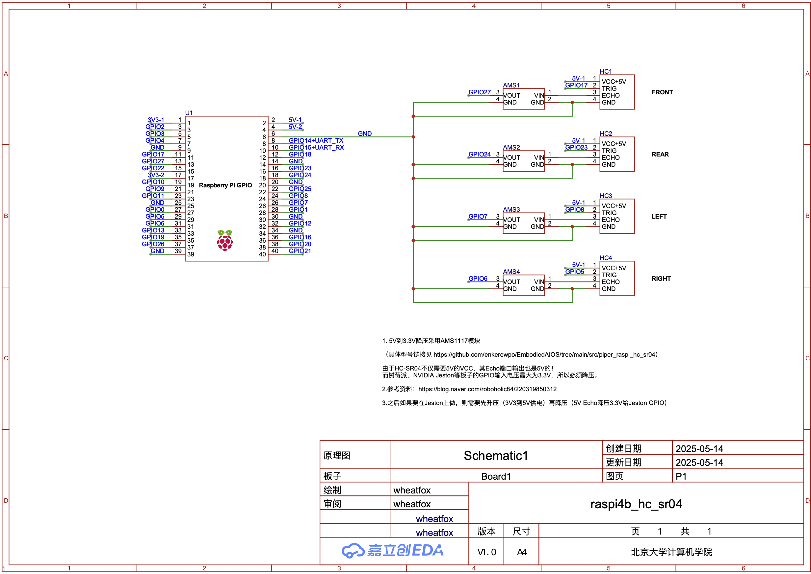

# HC-SR04 超声波传感器驱动（树莓派版）

基于 https://github.com/engcang/HC-SR04-UltraSonicSensor-ROS-RaspberryPi 修改，支持多个超声波传感器和ROS2网络通信。

## 硬件连接注意事项

1. 由于树莓派的输入最大为 3.3V，所以 Echo 过来的 5V 电压不能直接接到树莓派（会烧坏树莓派），需要使用电阻分压或用 AMS1117 芯片降压
2. 这里我采用了 https://detail.tmall.com/item.htm?detail_redpacket_pop=true&id=13301101281&ltk2=1747036883275pdkov4mb4hg9td9q8b49kk&ns=1&priceTId=214782fe17470368710688979e1ba4&query=5V%E9%99%8D%E5%8E%8B3.3V&skuId=4173505841581&spm=a21n57.1.hoverItem.3&utparam=%7B%22aplus_abtest%22%3A%227b45729bdea65b47781027bf9e88793e%22%7D&xxc=ad_ztc 的电路板进行 5V DC 到 3.3V 的降压
3. HC-SR04 的供电电压为 5V，接树莓派 5V 供电即可

系统原理图（2025.5.14）：



## 安装

```bash
# 请先安装 ROS2 humble

cd src/piper_raspi_hc_sr04
source /opt/ros/humble/setup.zsh # or setup.bash
pip install -r requirements.txt

# 运行驱动程序
python3 raspi_hc_sr04/driver.py

# 运行节点
./ros2_node.sh
```

TODO: 支持 colcon build，现在只支持上面这样的运行方式不支持 ros2 run 运行

## 查看数据

一个节点名字叫 `ultrasonic`，里面有多个 topic，每个 topic 对应一个传感器（在 `sensors.yml` 中配置）。

每个 topic 使用 ROS2（Humble）的 Range 消息类型，具体请参考 https://docs.ros.org/en/humble/p/sensor_msgs/msg/Range.html：

```yaml
# Radiation type enums
# If you want a value added to this list, send an email to the ros-users list
uint8 ULTRASOUND=0
uint8 INFRARED=1

uint8 radiation_type    # the type of radiation used by the sensor
                        # (sound, IR, etc) [enum]

float32 field_of_view   # the size of the arc that the distance reading is
                        # valid for [rad]
                        # the object causing the range reading may have
                        # been anywhere within -field_of_view/2 and
                        # field_of_view/2 at the measured range.
                        # 0 angle corresponds to the x-axis of the sensor.

float32 min_range       # minimum range value [m]
float32 max_range       # maximum range value [m]
                        # Fixed distance rangers require min_range==max_range

float32 range           # range data [m]
                        # (Note: values < range_min or > range_max should be discarded)
                        # Fixed distance rangers only output -Inf or +Inf.
                        # -Inf represents a detection within fixed distance.
                        # (Detection too close to the sensor to quantify)
                        # +Inf represents no detection within the fixed distance.
                        # (Object out of range)
```

本驱动使用超声波传感器，所以 `radiation_type` 为 `ULTRASOUND`，`field_of_view` 为 0.1，`min_range` 为 0.02，`max_range` 为 4.0。
并且请注意，`range` 的单位是米（driver 返回的 distance 单位是 cm，在 publish 时会转换为 m）。

```bash
ros2 topic list | grep sonic
ros2 topic echo /ultrasonic/sensor0_front
```

一个例子：

```bash
---
header:
  stamp:
    sec: 1747573704
    nanosec: 865057813
  frame_id: sensor0_front
radiation_type: 0
field_of_view: 0.10000000149011612
min_range: 0.019999999552965164
max_range: 4.0
range: 0.09544999897480011
---
```

## 配置

传感器配置通过 YAML 文件管理，位于 `raspi_hc_sr04/sensors.yml`。配置示例请参考仓库内的 yaml 文件。

每个传感器配置需要：
- `name`: 传感器名称
- `trig`: TRIG 连接的 GPIO 号（不是 pin 号）
- `echo`: ECHO 连接的 GPIO 号（不是 pin 号）

## tailscale 配置

https://www.danaukes.com/notebook/ros2/30-configuring-ros-over-tailscale/
https://github.com/tailscale/tailscale/issues/11972

```bash
sudo apt install -y ros-humble-rmw-fastrtps-cpp
```


wheatfox wheatfox17@icloud.com 2025