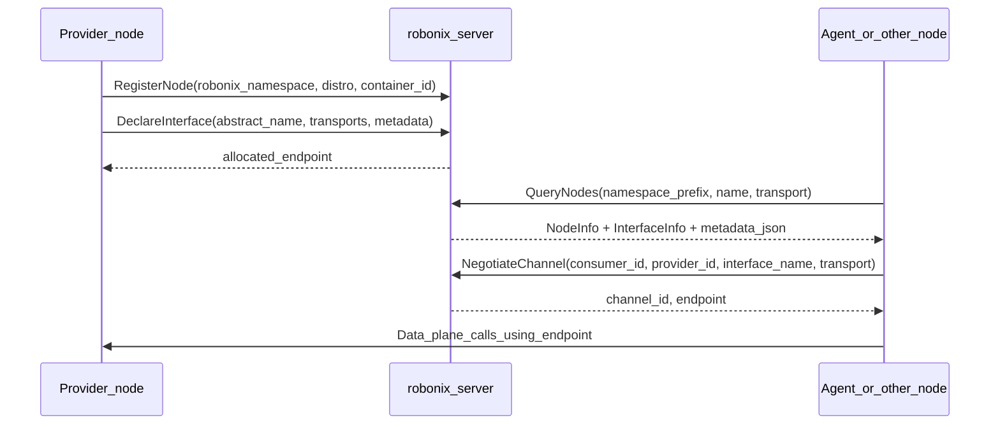

# PoC: abstract capability to concrete interface

This document walks through examples from the repo: how abstract capabilities are registered and how consumers find concrete endpoints via `robonix-server` only.

## Minimal PoC: host control plane + container ROS bridge

To run **without installing ROS 2 on the host**: start `robonix-server` on the host, then run the Tiago bridge (`tiago_node.py`) inside Docker (ROS 2 Humble + rclpy in the image). This does **not** start Webots or Nav2; the bridge still **registers** a node and `mcp_tools` interface, and subscribes to ROS topics (no publishers until you add a sim stack later).

```bash
cd rust
pip install -r examples/requirements.txt   # host needs grpcio>=1.78 (matches proto_gen)
./examples/scripts/poc_container_bridge.sh
```

The script uses [packages/tiago_sim_stack/compose.yaml](../examples/packages/tiago_sim_stack/compose.yaml) + [bridge/Dockerfile](../examples/packages/tiago_sim_stack/bridge/Dockerfile), runs `docker compose up`, then prints `QueryNodes` via [hal_discovery_poc.py](../examples/scripts/hal_discovery_poc.py). Use `SMOKE_USE_EXISTING_SERVER=1` if `robonix-server` is already running. On success the compose stack is left up; tear down with `cd rust/examples/packages/tiago_sim_stack && docker compose -f compose.yaml down`.

## Control-plane flow (matches `robonix_runtime.proto`)



- Namespace layer: `RegisterNode.namespace` is a tree path. Hardware and virtual hardware use `robonix/prm/...`; system services (VLM, maps, etc.) use `robonix/sys/...` (see [NAMESPACE.md](./NAMESPACE.md)). Example: `robonix/prm/tiago` is an integrated bridge mount point.
- Abstract capability: `DeclareInterface.name` (e.g. `mcp_tools`, `rgb`) is the control-plane name for that class of capability; tool lists or RPC names live in `metadata_json`.
- Concrete interface: `DeclareInterfaceResponse.allocated_endpoint` and `NegotiateChannelResponse.endpoint` are data-plane addresses (e.g. `localhost:50100`, `http://...`).

---

## Example 1: Tiago bridge (`tiago_bridge` package)

Canonical sources: [`examples/packages/tiago_bridge/`](../examples/packages/tiago_bridge/) (`robonix_manifest.yaml` + `tiago_bridge/node.py`). Docker entry: [`packages/tiago_sim_stack/`](../examples/packages/tiago_sim_stack/) (`rbnx build` / `rbnx start` or `compose.yaml`).

| Concept | Value |
|---------|-------|
| Mount point | `robonix/prm/tiago` (override with `ROBONIX_NAMESPACE`) |
| Node ID | `com.robonix.prm.tiago` (`ROBONIX_NODE_ID`, reverse-DNS) |
| Interface name | `mcp_tools` |
| Transport | `mcp` |
| Concrete ops | MCP tools such as `get_robot_pose`, `send_nav_goal`, `get_camera_image` (see `metadata_json.tools`) |
| Implementation (opaque to agent) | ROS 2 `rclpy`, Nav2 action, `/amcl_pose`, etc. |

What the consumer (agent) does:

1. It does not hardcode ROS topics; it discovers MCP-capable nodes via `QueryNodes(..., transport="mcp")`.
2. It reads `endpoint` and `tools` from `InterfaceInfo.metadata_json`.
3. It calls tools over MCP HTTP; the bridge translates to ROS.

Same pattern applies for other arms, bases, or cameras: discover by namespace and interface name on the server, then use the negotiated endpoint.

---

## Example 2: hypothetical arm Cartesian interface (spec level)

If a vendor exposes `MoveL` over gRPC:

| Concept | Example |
|---------|---------|
| Namespace | `robonix/prm/franka/manipulation` |
| `DeclareInterface.name` | `cartesian_pose` or `arm` |
| `supported_transports` | `grpc` |
| `metadata_json` | e.g. `{"contract":{"rpc_method":"/arm.v1.Arm/MoveL"}}` |
| Consumer | `NegotiateChannel(..., transport="grpc")`, then gRPC to `endpoint` |

Stability comes from keeping the same `interface.name` + transport semantics in docs/schema; implementations can swap if they register the same name and valid metadata.

---

## Example 3: VLM (`vlm_service.py`)

| Concept | Value |
|---------|-------|
| Namespace | `robonix/sys/model/vlm` (see `RegisterNode` in `vlm_service.py`) |
| Capability | Multimodal chat / vision (interface name `chat`) |
| Transport | `grpc` (VLM data plane separate from control plane) |
| Discovery (current) | Agent sends `QueryNodesRequest { abstract_interface_id: "robonix/sys/model/vlm/chat", transport: "grpc" }`; legacy split query if `ROBONIX_VLM_ABSTRACT_INTERFACE_ID` is empty; then `NegotiateChannel` |
| Target model | System abstract interface ID is `robonix/sys/model/vlm/chat` (path + interface leaf); catalog and validation are described in [NAMESPACE.md](./NAMESPACE.md) under “System abstract interfaces”. |

The abstraction is “vision-language service”; provider URL and model name stay inside the process (env). Multiple instances: see NAMESPACE.md (`instances/...` or a documented `:n` suffix).

---

## Runnable PoC (control-plane discovery only)

No ROS required—query the global server and list registered nodes and interfaces:

```bash
cd rust
# Terminal 1
cargo run -p robonix-server

# Terminal 2
export ROBONIX_SERVER=127.0.0.1:50051
python3 examples/scripts/hal_discovery_poc.py
```

If `tiago_node` or `vlm_service` is running, the script prints their `namespace` and interface summary.

For a fuller E2E, see `examples/MINIMAL_PLATFORM.md`.
